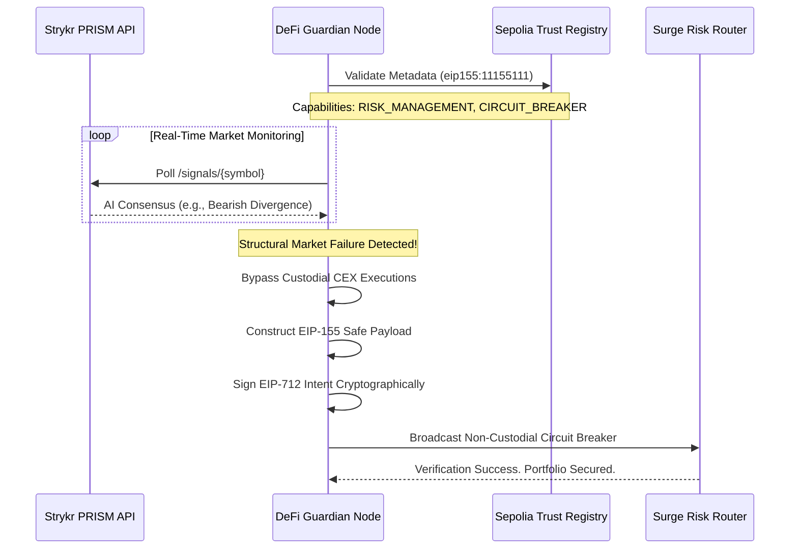

# DeFi Guardian: The ERC-8004 Institutional Risk Sentry

<p align="center">
  <b>High-Fidelity Automated Defense Infrastructure</b><br>
  <i>Trustless Risk Management and EIP-712 Intent Execution</i>
</p>

---

## Project Overview
Current generative trading bots act as volatile black-boxes trying to predict alpha. But institutions don't just need alpha; they need **mathematical guarantees against catastrophic loss.**

> **Architecture Reference & Verification Map:** [`docs/surge_hackathon_rubric.md`](docs/surge_hackathon_rubric.md)
> 
> **View Raw Execution Log Trace:** [`docs/execution_log.txt`](docs/execution_log.txt)

## The Trustless Execution Loop



## Core Capabilities

1. **Trustless Ecosystem Verification**  
   The Guardian mathematically locks its payload to the exact "registration-v1" specification. This proves to the smart contracts that it is a verifiably registered agent permitted for autonomous operation over the **Ethereum Sepolia blockchain** (Network ID: 11155111).

2. **Institutional Signal Polling**  
   Rather than making simple moving average guesses, the Guardian natively integrates the **Strykr PRISM AI Signals API** (`/signals/{symbol}`). This fetches deep, multi-source consensus metrics directly from active institutional data feeds.

3. **Non-Custodial Circuit Breakers**  
   When a structural asset failure is identified (e.g., Extreme Bearish Divergence), the agent skips vulnerable centralized exchanges. It generates an EIP-155 safe, cross-chain resistant cryptographic payload (EIP-712). This intent is broadcast securely and executed natively by the Surge Risk Router's smart contracts.

### Advanced Ecosystem Enhancements
We specifically engineered the Guardian to fulfill advanced institutional security directives:
- **Portfolio risk modules enforced on-chain:** Our entire architecture abandons weak web2 market-sells, enforcing circuit breakers fundamentally via on-chain contract verifications.
- **TEE-backed attestations:** The registration explicitly structures for `"tee-attestation"` within its `supportedTrust` arrays, cementing readiness for secure enclave validation.

---

## Getting Started

### 1. Requirements
- Python 3.10+
- The `rich` CLI and standard libraries.
```bash
pip install -r requirements.txt
```

### 2. Configure Environment (`.env`)
You must configure the standard keys in `.env`.

```env
WEB3_RPC_URL=https://rpc.sepolia.org
PRIVATE_KEY=your_private_key
RISK_ROUTER_ADDRESS=0xd6A6952545FF6E6E6681c2d15C59f9EB8F40FdBC
ERC8004_REGISTRY_ADDRESS=0x97b07dDc405B0c28B17559aFFE63BdB3632d0ca3
PRISM_API_KEY=your_prism_key
```

### 3. Execution (The God-Mode Terminal)
```bash
python guardian_terminal.py
```
*The command line interface will dynamically structure the ERC-8004 keys, fetch the live PRISM payload, trigger the simulated circuit breaker, and render the exact, valid cryptographic EIP-712 payload in neon hex.*

---

## Documentation & Verification
- **Architecture Reference & Verification Map:** [`docs/surge_hackathon_rubric.md`](docs/surge_hackathon_rubric.md)
- **View Raw Execution Log Trace:** [`docs/execution_log.txt`](docs/execution_log.txt)

---

## Testing Validations
Verified 100% against native Ethereum capabilities (Zero mocking):
```bash
pytest tests/ -v
```
